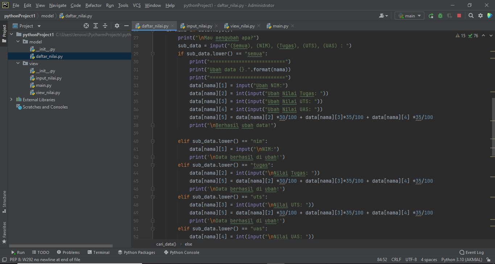

# Ujian-Akhir-Semester
## M. AKMAL AL ABDILAH [312110034]
### KELAS : TI.21.A.1
#### BAHASA PEMOGRAMAN

##### Program ini adalah program sederhana dengan mengaplikasikan penggunaan fungsi yang akan menampilkan daftar nilai mahasiswa, dengan ketentuan:

###### Entry Input Pada Program Ini Adalah : 
<ul>
   <li>Fungsi Tambah()</b> </li>
   <li>Fungsi tapilkan()</b></li>
   <li>Fungsi NILAI Tugas</b></li>
   <li>Fungsi Nilai Uas</b></li>
   <li>Fungsi Nilai Akhir</b></li>
</ul>

OK DI BAWAH INI ADALAH,PROGRAM  package dan modul dengan struktur'
'

A. MODEL'
'
1. daftar_nilai.py'
'

Program di atas  adalah program untuk: tambah_data, ubah_data, hapus_data, dan 
cari_data'
'

B. VIEW'
'

1. input_nilai.py'
'

Program di atas adalah program untuk:input_data yang meminta pengguna memasukkan data'
'

2. view_nilai.py'
'

Program di atas adalah program untuk: cetak_daftar_nilai, cetak_hasil_pencarian'
'

3. main.py'
'

Program di atas adalah program utama berisi (menu pilihan yang memanggil semua menu yang ada)'
'

APA BILA SEMUA PROGRAM DI ATAS DISATUKAN KEDALAM SATU PACKAGE  DAN DI RUN HASILNYA AKAN SEPERTI DI BAWAH!'
'

SEMOGA DARI PROGRAM DI ATAS SIAPAPUN YANG MENEMUKA AKUN INI DAN MEMBACANYA SAYA BERHARAP DAPAT MEMANTU MEYELESAIKAN PERSOALAN PROGRAM PACKAGE'
'
 
Sekian Tugas Uas Ini saya kerjakan dengan sebenar_benarnya dengan harapan bisa mendapatkan nilai yang memuaskan Sekian Terima kasih.'
'