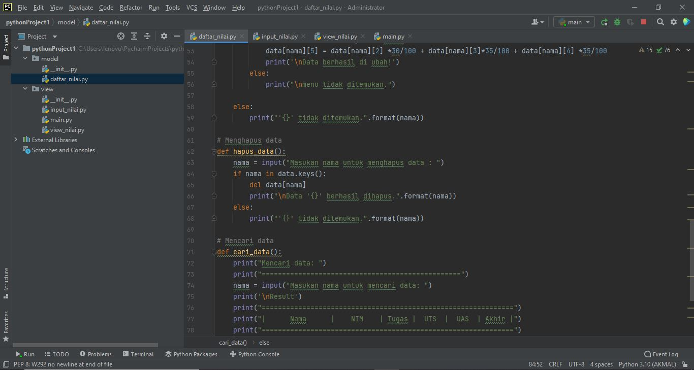

# Ujian-Akhir-Semester
## M. AKMAL AL ABDILAH [312110034]

OK DI,PROGRAM  package dan modul dengan struktur'
'

A. MODEL'
'
1. daftar_nilai.py'
'

B. VIEW'
'
1. input_nilai.py'
'

2. view_nilai.py'
'

3. main.py'
'

APA BILA PROGRAM DI ATAS DI RUN HASILNYA AKAN SEPERTI DI BAWAH!'
'

 
Sekian Tugas Uas Ini saya kerjakan dengan sebenar_benarnya dengan harapan bisa mendapatkan nilai yang memuaskan Sekian Terima kasih.'
'